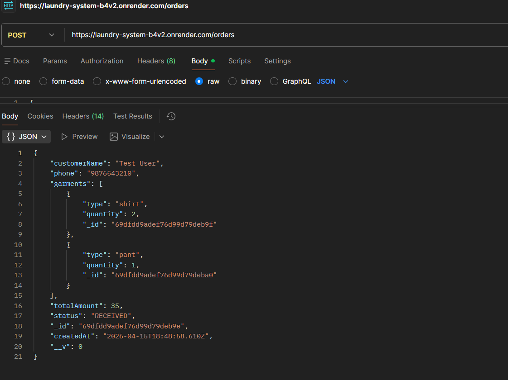
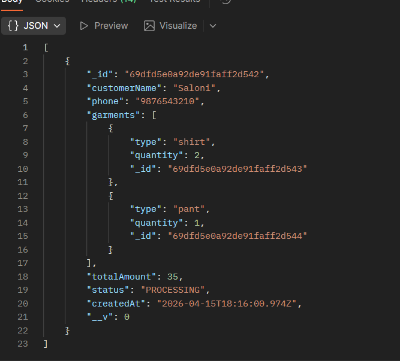
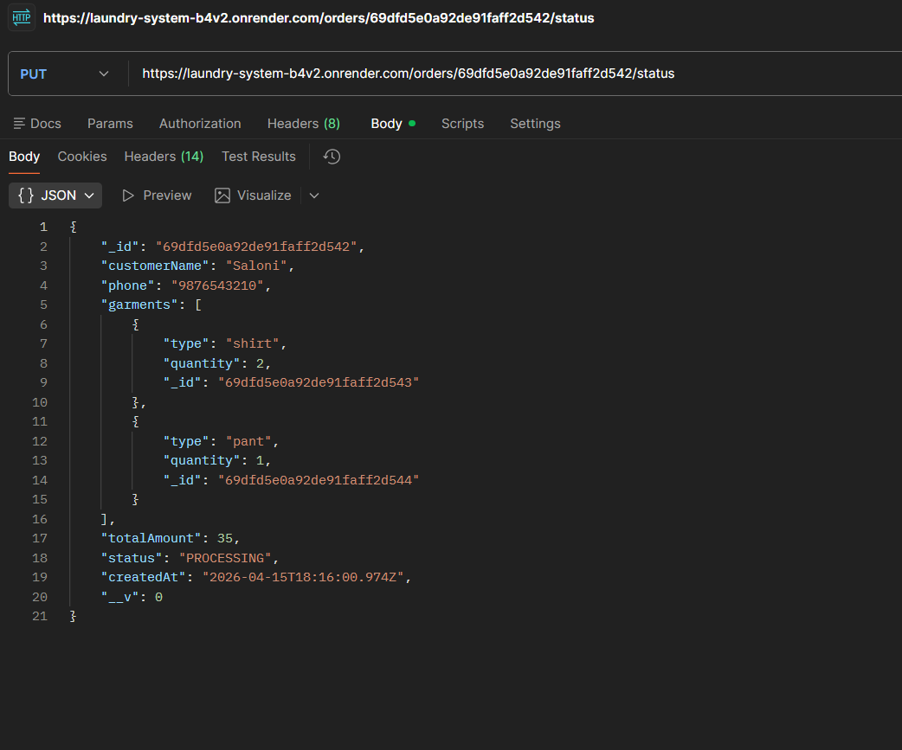
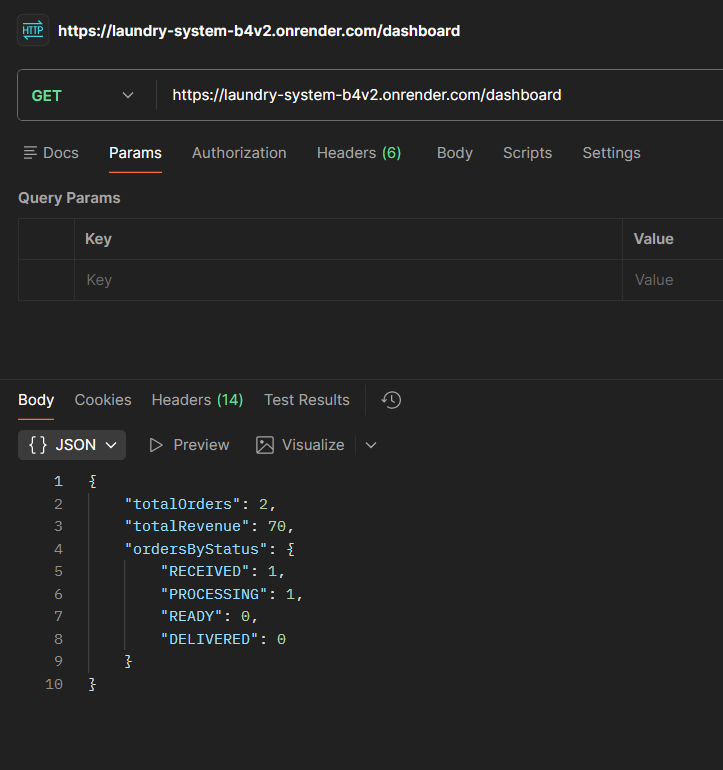

# 🧺 Laundry Order Management System

## 📌 Project Overview
This is a backend system for a dry cleaning store to manage orders, track status, calculate billing, and view dashboard analytics.

---

## 🚀 Features

- Create laundry orders
- Auto calculate total billing
- Update order status (RECEIVED, PROCESSING, READY, DELIVERED)
- View all orders
- Filter orders
- Dashboard with:
  - Total orders
  - Total revenue
  - Orders by status

---

## 🛠 Tech Stack

- Node.js
- Express.js
- MongoDB Atlas
- Mongoose
- Render (Deployment)

---

## 🔗 Live API

https://laundry-system-b4v2.onrender.com

---

## 📡 API Endpoints

### Create Order
POST /orders

### Get Orders
GET /orders

### Update Status
PUT /orders/:id/status

### Dashboard
GET /dashboard

---

## 🤖 AI Usage

- Used ChatGPT for backend structure
- Used AI for debugging MongoDB connection issues
- Used AI for deployment guidance on Render

---

## ⚠️ Tradeoffs

- No frontend UI (API-based project)
- Basic validation only
- No authentication implemented

---

## 📈 Future Improvements

- Add frontend (React)
- Add login/auth system
- Add better validation
- Deploy frontend with backend
